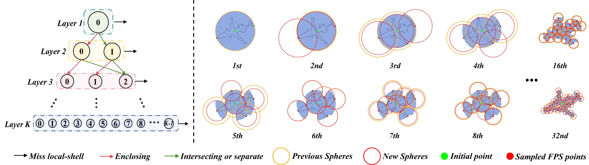
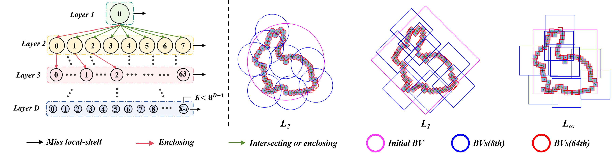

# Inverse Farthest Point Sampling (IFPS)

This repository is the official implementation of our paper:

__Inverse Farthest Point Sampling (IFPS): A Universal and Hierarchical Shell Representation for Discrete Data__

Links: [[Video(Youtube)]](https://youtu.be/uHoOZuhxPY0)

## Method

**Core idea in one sentence**. Using the first N sampled points, the IFPS shell can be constructed to encapsulate all original discrete points, employing hierarchical management.

### Pipeline


### IFPS Shell Construction Results



### IFPS Shell under Various Norms



# Setup

Python 3 dependencies:

* numba 0.58.1
* trimesh 4.1.4
* h5py 3.10.0


```
conda create -n Ifps python=3.8
conda activate Ifps
conda install pytorch==2.1.1 torchvision==0.16.1 torchaudio==2.1.1 pytorch-cuda=11.8 -c pytorch -c nvidia
pip install .
```


# DataSet
You can use the example dataset in IFPS/dataset/thingi32_normalization/ or you can put your custom datasets in IFPS/dataset/ directory.

# Configurations
All configurable settings are accessible within the IFPS/utils/options.py


# Run
```
python example.py
```
